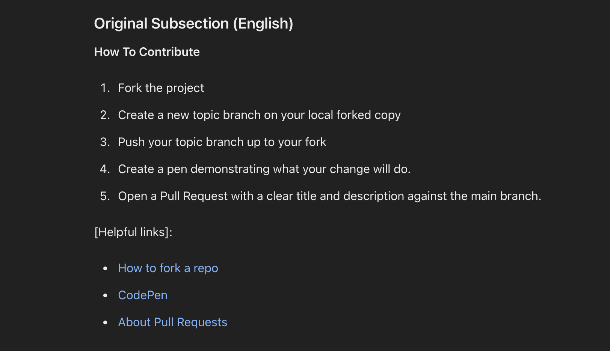
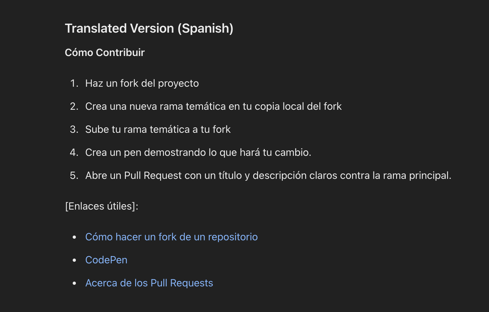
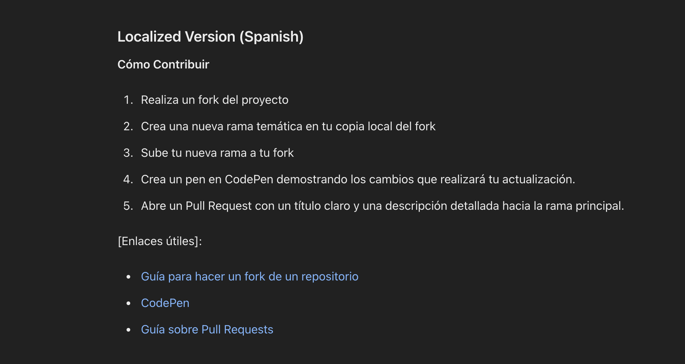
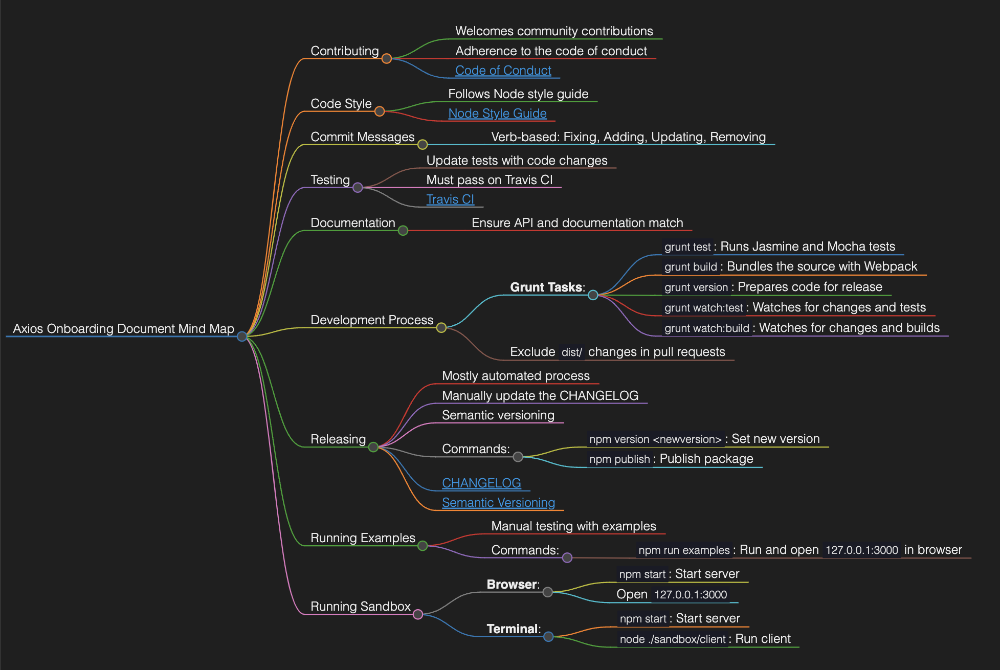

# LLMs-for-Improving-Onboarding-Documentation-Accessibility
Consistent, diverse, and quality contributions are essential to the sustainability of the open-source community. Therefore, it is important that there is infrastructure for effectively on-boarding and retaining diverse newcomers to open-source software projects. 
Most often, open source projects rely on onboarding documentation to support newcomers in making their first contributions. 
Given its importance to the onboarding process in open source, it is critical that we understand how we can support the creation of inclusive and accessible onboarding documentation. 
Large language models (LLMs) have shown great potential in providing text transformation support in other domains, and even shown promise in simplifying or generating other kinds of computing artifacts, such as source code and technical documentation. 

**VISION**

EXAMPLE SHOWING TRANSLATION AND LOCALIZATION TO SPANISH
********************************************************
ENGLISH VERSION
********************************************************
 
********************************************************
SPANISH VERSION
********************************************************
 
********************************************************
SPANISH LOCALIZED VERSION
********************************************************
 

The Localized version adjusts phrases to sound more natural and familiar to Spanish-speaking users, making minor modifications to fit local expressions.

VISUALIZATION USING MIND-MAPS
********************************************************
EXAMPLE SHOWING VISUALIZATION OF AXIOS OPEN-SOURCE PROJECT
********************************************************
 
